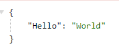
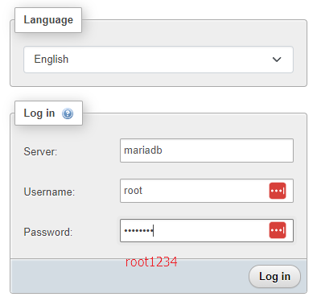
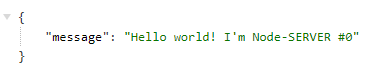

# Traefik-nmp-fastapi-node
Docker에서 Traefik의 Reverse Proxy를 사용해서  VPS내에서 아래의 서비스를 할 수 있게 만듬.
### PHP (Gnuboard5)
2개의 subdirectory(demo, gnuboard)에 가각의 서비스를 구현함(nginx를 사용)
- PHP-FPM
- Nginx
- Mariadb
- phpmyadmin
### Node
- 노드 서버를 2개 구성함.
### Fastapi
- FastApi 서버를 구현함.

## 로컬에서 사용방법
1. Docker를 설치
2. git clone or download
3. /etc/hosts 파일에 다음을 추가 (윈도우에서는 다른 디렉토리)
```
127.0.0.1      gnuboard.test         #laragon magic!
127.0.0.1      demo.gnuboard.test    #laragon magic! 
127.0.0.1      www.gnuboard.test     #laragon magic!
127.0.0.1      pma.gnuboard.test     #laragon magic!
127.0.0.1      node0.gnuboard.test   #laragon magic!
127.0.0.1      node1.gnuboard.test   #laragon magic!
127.0.0.1      traefik.gnuboard.test #laragon magic!
127.0.0.1      fastapi.gnuboard.test #laragon magic!
```
4. docker compose 실행
- 실행
```
docker compose up -d
```
- 제대로 동작되는 지 체크
```
docker compose ps
```
- 동작을 멈춤.  다시 빌드등
```
docker compose down
```
- 그외에
```
docker images
docker rmi [Image ID]
```
- 편하게 `Docker Desktop` 에서 처리

## 각 모듈 동작
- fastapi.gnuboard.test


- pma.gnuboard.test


- node0.gnuboard.test


- node1.gnuboard.test


- traefik.gnuboard.test
id: user
password: password


- www.gnuboard.test 와 demo.gnuboard.test
동작이 안됨.